# 业务参考项目搭建教程

本教程主要描述如何在本地运行业务参考系统，便于分析业务流程。

由于参考业务项目开放的代码没有开放所有功能或者多多少少存在一些bug，所以所有操作还是建议参考在线示例。

跑本地项目的目标在于可以观察数据库中数据的变化。

参考链接：[本地化部署说明](https://gitee.com/ibizlab/iBizEHR/wikis/本地化部署说明)

## 1 准备代码和数据库

通过下面方式克隆代码：

```sh
git clone https://gitee.com/ibizlab/iBizEHR.git
```

执行**`sql`**目录下面的`sql`脚本，构建数据库和表，注意仔细阅读该目录下面的`README.md`。

## 2 搭建后端

将项目导入IDEA，等待项目初始化完成，可以看到如下图所示的结构

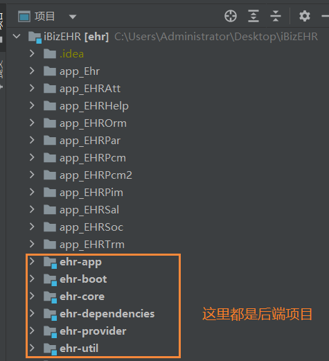

### 2.1 修改配置

修改`ehr-boot`配置文件

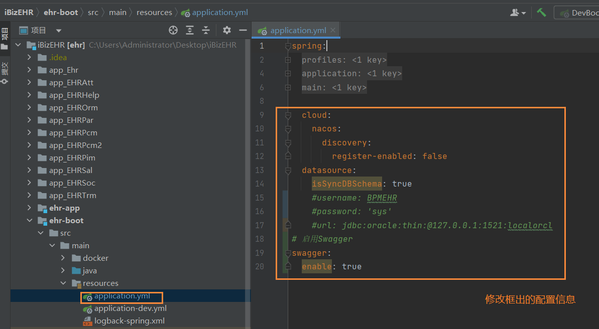

修改`ehr-util`配置

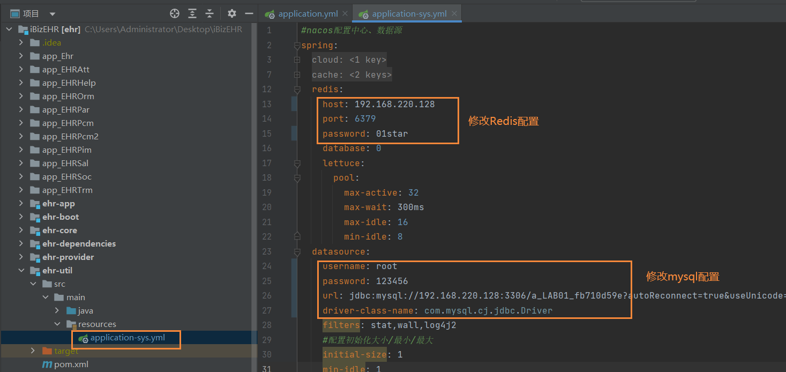

### 2.2 启动项目

找到`ehr-boot`程序入口，点击运行，开始编译和运行程序。

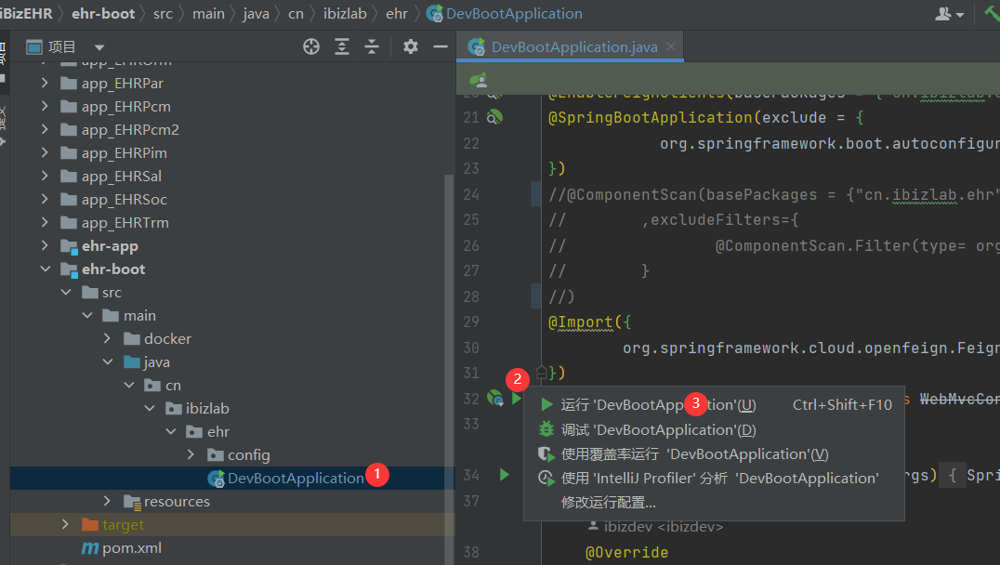

编译程序然后运行成功后，可以看到类似如下图所示的效果，

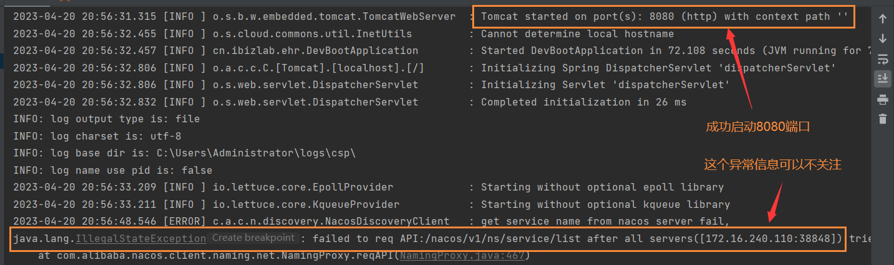

然后访问swagger文档，访问地址http://127.0.0.1:8080/swagger-ui.html 

可以看到类似下图所示的效果。

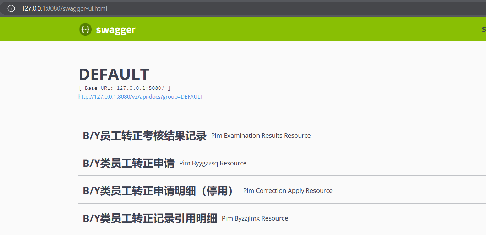

### 2.3 操作失败

如果在启动编译过程中程序出错，建议使用我在群里面下发的修改后的代码进行操作，因为开源代码本身可能存在一些兼容性问题。

另外项目编译需要大量内存，有可能你IDEA分配的内存不够，导致编译失败，此时建议修改IDEA编译器的内存，操作步骤如下图所示。

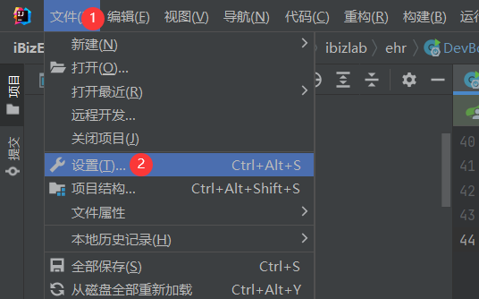

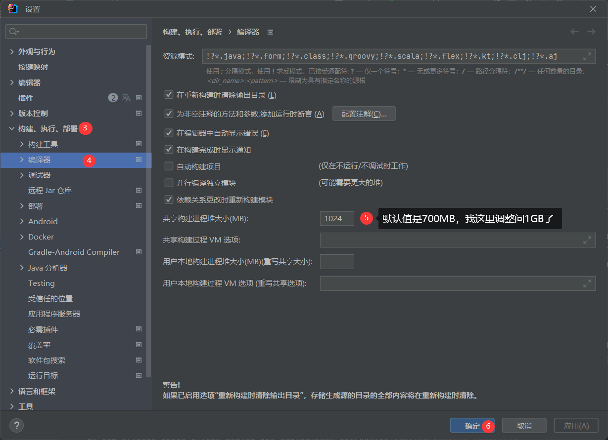

## 3 搭建前端

### 3.1 前置准备

你要启动前端需要保证你的系统上面有`NodeJS、yarn`环境，可以参考我帮助文档目录下面提供的搭建`NodeJS`环境文档。

使用下面命令安装 `Vue Cli (3.0)`构建工具

```powershell
yarn global add @vue/cli
```

在源代码中以`app_`开头的目录都是前端项目，如下图所示：

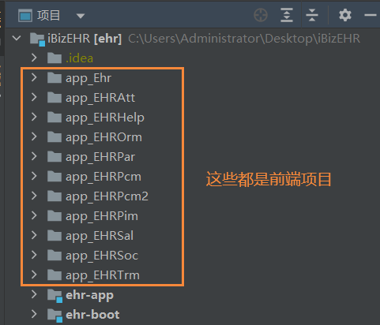

所有前端启动操作模式都是相同，这里只演示`app_Ehr`前端的启动作为步骤参考。

首先你需要进入源码目录，然后按照后续步骤操作项目，下图是我通过命令行进入对应前端项目的目录。

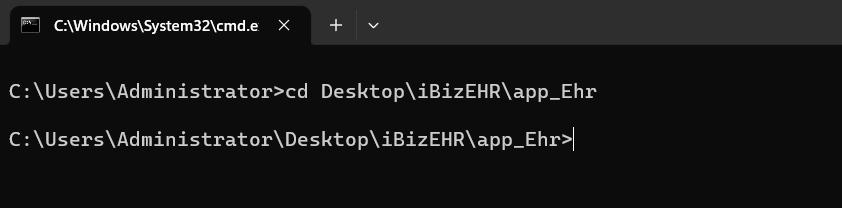

### 3.2 删除文件

由于你需要重新下载`JS`库依赖，所以需要把版本锁定文件删除掉，避免不同版本的构建工具可能构建失败。

需要删除掉的文件包括

- `yarn.lock`
- `package-lock.json`

### 3.3 安装依赖

执行下面命令安装依赖

```powershell
yarn install
```

下图是依赖安装完成

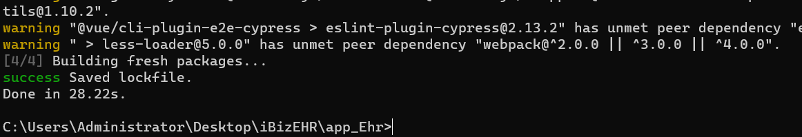

### 3.4 测试启动

依赖安装完成后通过执行下面命令测试启动

```powershell
yarn dev-serve
```

下图是启动成功示例

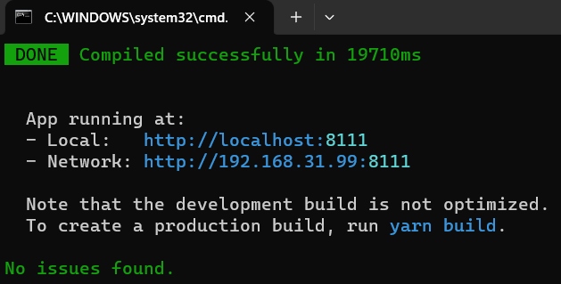

然后你就可以访问控制台上面提示的地址，进行测试。

打开连接后可以看到如下图所示的效果

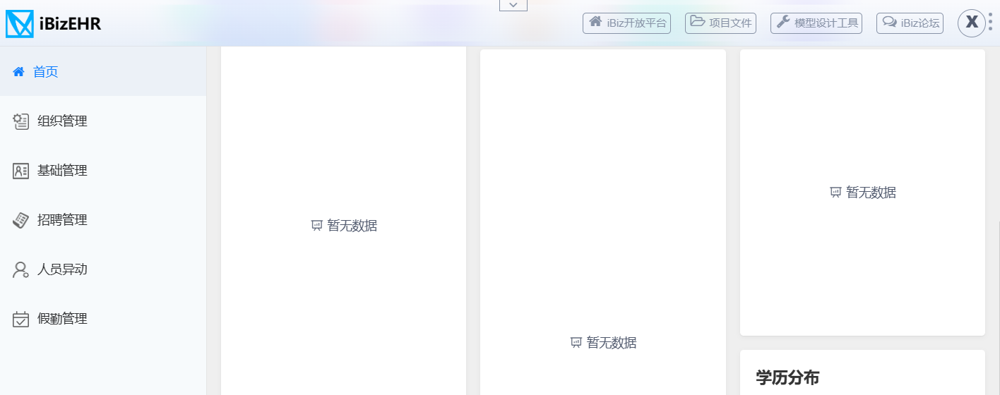

这儿需要注意一点，此时启动的项目访问的数据是我们前端的mock数据，如需与后台直接交互，请往后看。

### 3.5 远程代理

结束上一步的前端服务，然后修改远程代理文件 `vue.config.js` 代理地址，示例如下图所示。

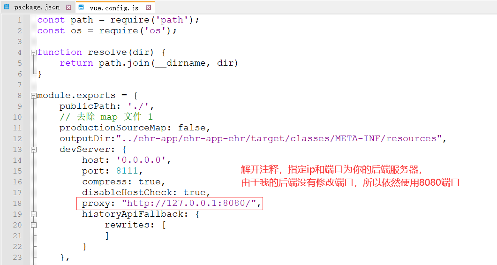

执行下面命令启动前端

```powershell
yarn serve
```

启动成功后，再次访问浏览器，这次就是进入了登录页面

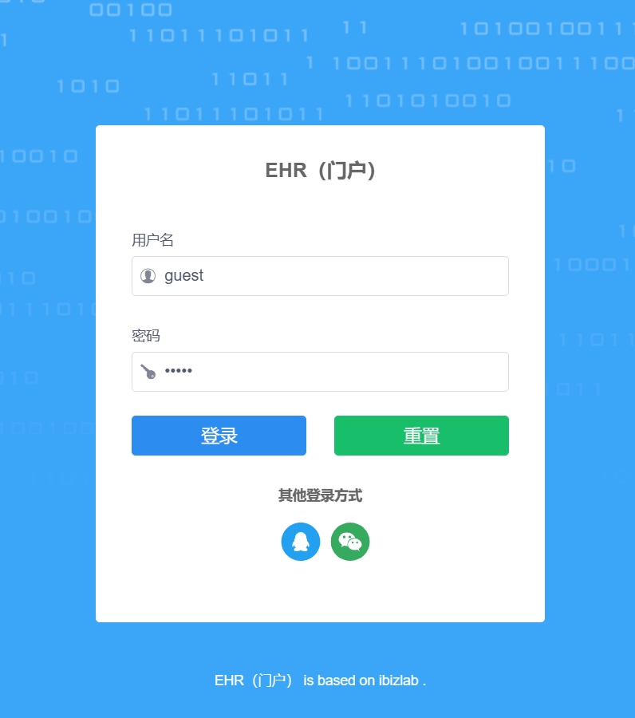

点击登录后主面板效果如下图所示

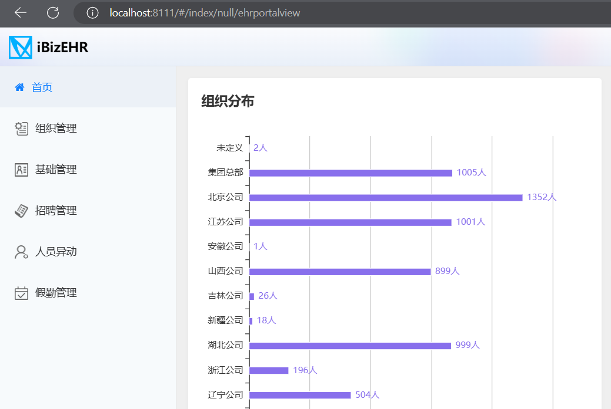

***提示：共用账号密码***

- 账号：ibzadmin
- 密码：123456

### 3.6 操作失败

同样的，如果在启动编译过程中程序出错，建议使用我在群里面下发的修改后的代码进行操作，因为开源代码本身可能存在一些兼容性问题。

比如我调整了`package.json`里面某些依赖库的版本号，如下图所示

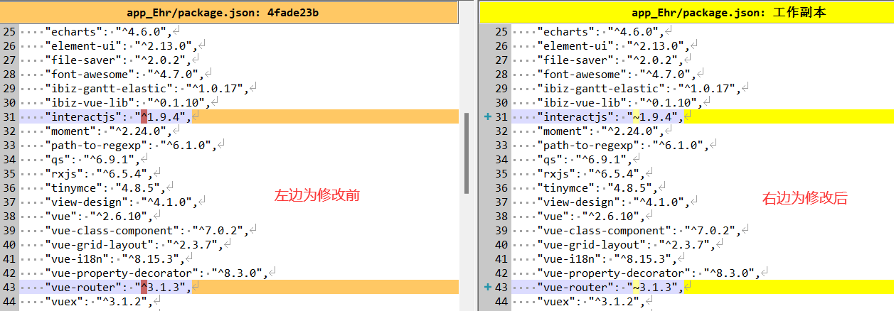

还有修改了`vue.config.js`


还有某些ts编译错误，比如


总之开源的东西，会存在一些问题是很正常的

## 4 Docker一键部署

除了上面的本地部署外，官方还提供了docker部署方案，具体过程参考官方演示

[Docker-Compose 一键部署 ](https://gitee.com/ibizlab/iBizEHR/wikis/Docker-Compose 一键部署)
